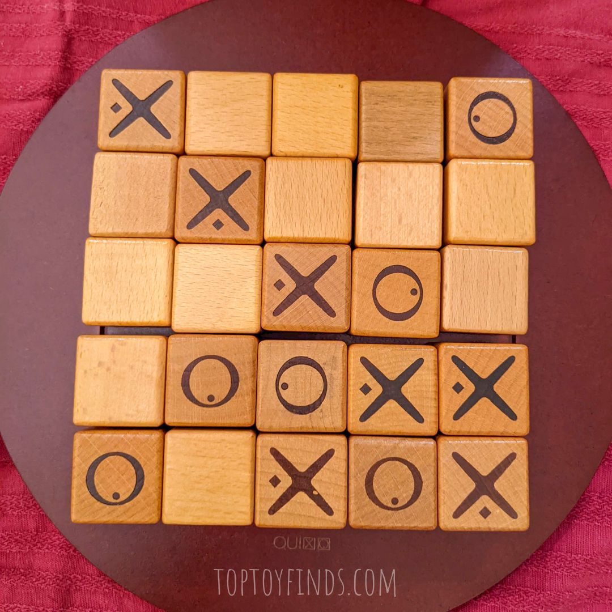
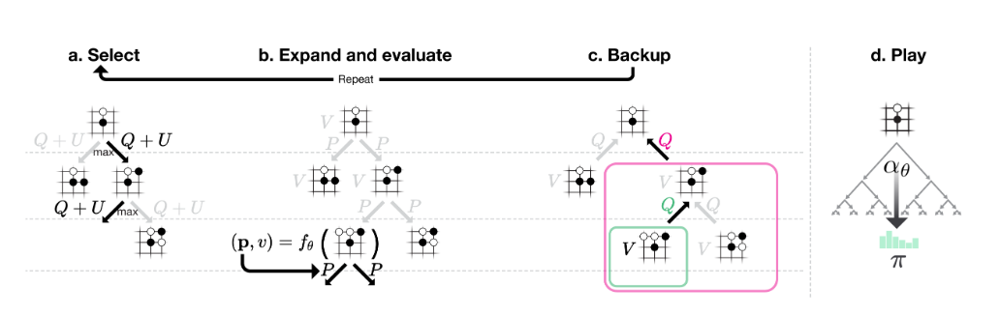
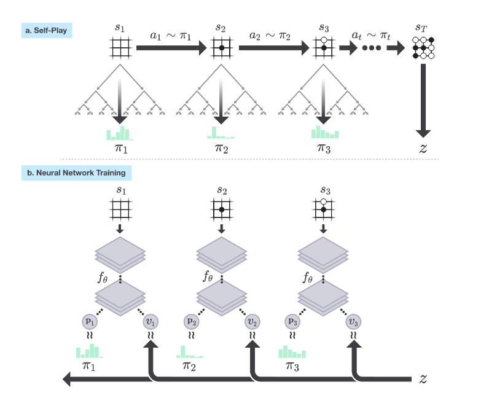

# Quixo Reinforcement Learning Agent (QuixoZero Lite)

A Python project implementing a Reinforcement Learning agent to play the board game **Quixo**, following an approach inspired by 
the paper "AlphaZero-Inspired Game Learning: Faster Training by Using MCTS Only at Test Time" [4]. 
This approach trains the agent using Temporal Difference (TD) learning with n-tuple networks and then uses Monte-Carlo Tree Search (MCTS) 
when implementing the agent for evaluation only.

## Features

- Self-play training using TD learning with n-tuple networks. 
- MCTS wrapper for implementing agent.
- Encode/decode Quixo boards for efficient storage and computation.
- Save and load trained models (`.npz` files).
- Optional GUI interface to play against trained agent.

## Installation

1. Clone the repository:

```bash
git clone https://github.com/hbu90/quixozerolite.git
cd alphazeroquixo
```
2. Install dependencies:

```bash
pip install poetry
poetry install
```

## Training

```bash
python train_quixo.py -n <name-of-run>
```

### Quixo

Quixo is a board game played on a 5x5 grid, which contains 25 pieces (also called cubes or tiles). 
The cubes have four blank faces, and one face with an X and one face with an O. 
The game has some resemblance to Tic-Tac-Toe, but with more complexity; the board is dynamic in that a placed cube may 
change its place in subsequent moves and the game length is theoretically unbounded in the number of moves [1]. 

Each player take it in turns to select a cube that is either blank or bearing their own symbol (X or O) from
the border pieces of the 5x5 board and then returns it to the board bearing the player's own symbol, 
**by pushing it into one of the rows it was taken from**. The game is won when either player has five of their 
pieces either horizontally, vertically, or diagonally.

The game of Quixo is a zero-sum game of perfect 
information (each player can see the entire board and the moves each player makes). The state space is
2 &middot; 3<sup>25</sup> if we also consider whose turn it is to move. However, not all of these states are necessarily reachable. For contrast,
Tic-Tac-Toe has 3<sup>9</sup>, Connect Four has 4.5 &middot; 10<sup>12</sup>, Chess is 10<sup>46</sup>, and Go is 10<sup>170</sup>. 
The game of Quixo does not have the same complexity of Chess or Go, but is similar to Connect Four in scale. 

Research into the game of Quixo has stated that with perfect play from both players, Quixo is a draw game [1] 
and that neither player can force a win under perfect play.



### N-tuple networks

Scheiermann, J. and Konen, W. state that "the main goal of n-tuple systems is to map a highly non-linear function in a low 
dimensional space to a high dimensional space where it is easier to separate 'good' and 'bad' regions" [4]. An N-tuple is effectively a
pattern of the board, such as the top row or a 3x3 grid in the bottom corner, and can be more formally defined as "a sequence of n cells of the board" [5]. 
An N-tuple network is a collection of N-tuples and their associated weight table.

With this network, for each tuple, the values of the selected board positions are encoded as a base-3 index, since each Quixo
board position can contain one of three values:

- `-1`: O
- `0`: empty
- `1`: X

The N-tuple network learns an approximation of the value function. Each possible configuration of an N-tuple has an associated
learned weight. The value of a board is calculated by summing the weights associated with the observed configuration of each tuple and 
the resulting value is passed through a hyperbolic tangent function so that the predicted value lies approximately in the range between -1 and 1.

The network contains both manually designed and randomly generated tuples. The manually designed tuples include rows, columns, diagonals, 2×2 blocks,
3×3 blocks, and offset patterns. Additional random walk tuples are used to capture board relationships that may not be represented by the hand-designed patterns.

### Temporal Difference (TD) Learning

TD learning is a reinforcement learning method that uses bootstrapping to update the value of states by using the value of the subsequent state and any reward received.
After each move, the network's estimate of the current state is compared with the reward and the estimate of the next state.

For the training of our agent, we implement the TD-FARL algorithm [5], and we train the network using both players' experience of the board. The symmetrical nature of
Quixo is also used when updating the weights to help improve learning. 

 [5]

The TD error is:

δ<sub>t</sub> = r<sub>t+1</sub> + γV(s<sub>{t+1}</sub>) - V(s<sub>t</sub>)

Eligibility traces allow the TD error to influence multiple previously visited states rather than only the immediately preceding state. A 
fixed horizon is implemented to reduce the computational costs of this update. 

The eligibility trace for each N-tuple weight is decayed according to:

e<sub>t</sub> = γλe<sub>{t-1}</sub>

The weights, w, are then updated according to:

w ← w + αδe

where α is the learning rate, δ is the TD error,and e is the eligibility trace. 

Final adaption (the FD of the algorithm name) ensures that the reward for the other player, which will typically be negative, is used in learning [5]. 

### AlphaZero

AlphaGo Zero [2] was trained using self-play 
reinforcement learning, without any supervision. It used a single neural network (rather than previous iterations, 
AlphaGo Fan and AlphaGo Lee, which used distinct policy and value networks). The input to the neural network is the 
state of the board, s, and the outputs are the probabilities of each action and a scalar value (which estimates the 
probability of the current player winning from the position s). 

AlphaZero [3] was the generalisation of the AlphaGo Zero approach. 

### MCTS and Self-Play

The MCTS uses the neural network to guide the simulations.  Within the MCTS, visit counts, values, average values, and probabilities are 
stored for each state. The MCTS traverses the tree from a given root node (a node equals the game state here), using the PUCT score to select the action, 
until a leaf node is found. A leaf node is a node that has not been explored by the MCTS previously. 

The PUCT score is calculated for every action and uses the values, an exploration parameter, the probabilities, and the 
visit counts, to determine the action 

score(a) = Q(a) + c<sub>puct</sub> · P(a) · √N / (1 + N(a))

A Dirichlet distribution generates random noise at the root node to encourage the agent to attempt more diverse early moves. This additional exploration 
in the AlphaGo Zero paper uses a Dir(0.03) distribution and updates probabilities so:

P(s,a) = (1 - ε)pₐ + ε ηₐ, where η ∼ Dir(0.03)

When a leaf node is found, it is added to a queue for eventual expansion. This is done in batches for efficiency.
The neural network is used to evaluate and returns values and probabilities for each of the leaf nodes, which are then passed 
into the MCTS statistics. 

Backup is the phase where the MCTS statistics are updated i.e., the visit counts for each node are updated and the values/average values are 
also updated. 

An action is selected after all of this by querying the visit counts stored in the MCTS. This is dependent on τ, a temperature parameter
that can control the degree of exploration within the MCTS policy distribution. 

In AlphaGo Zero and AlphaZero, no rollouts are used (which was not the case for AlphaGo Fan and AlphaGo Lee).
A rollout is where the game is played onwards from the leaf node to estimate the strength of the position.



Self-play is where the program plays against itself, instead of against a human or another program. The program is provided 
with complete information of the game structure and rules, but is not given any heuristics or rules on what policy to use. 

MCTS is described as a tool for both policy improvement and policy evaluation [2], 
as these searches are iterated within self-play and used to select each move. Subsequently, the neural network is then 
trained with the results of the more recent self-play data which includes moves and the winner (z). 



## Evaluation


## References

[1] Tanaka, S. et al. "Quixo Is Solved" (2020). https://arxiv.org/abs/2007.15895

[2] Silver, D. et al. "Mastering the game of Go without human knowledge" (2017). https://www.nature.com/articles/nature24270

[3] Silver, D. et al. "Mastering Chess and Shogi by Self-Play with a General Reinforcement Learning Algorithm" (2017). https://arxiv.org/abs/1712.01815

[4] Scheiermann, J. and Konen, W. "AlphaZero-Inspired Game Learning: Faster Training by Using MCTS Only at Test Time" (2022). https://arxiv.org/abs/2204.13307

[5] Konen, W. and Bagheri, S. "Final Adaptation Reinforcement Learning for N-Player Games" (2021). https://arxiv.org/abs/2111.14375 
